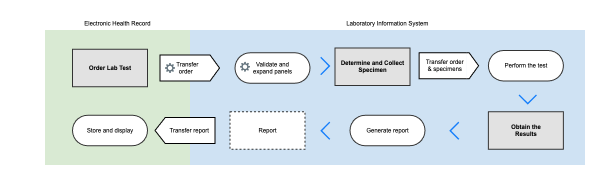

# 3.1 Clinical Workflow

_This page outlines the key clinical scenario/workflow where SNOMED CT and the LOINC Ontology are essential for standardizing and structuring healthcare data._

***

\\

The integration of laboratory test data between Electronic Health Records (EHR) and Laboratory Information Systems (LIS) is crucial for ensuring efficient, accurate, and consistent patient care. To achieve this, healthcare systems leverage standardized coding systems such as SNOMED CT and LOINC. SNOMED CT provides a comprehensive clinical terminology for describing patient data, while LOINC offers a universal standard for identifying lab tests and their results.

1. **Ordering Lab Tests**
   1. Clinicians use SNOMED CT codes to search and select tests in the EHR system.
   2. The selected tests are associated with LOINC codes, ensuring standardized data for lab orders.
2. **Transferring Orders to the Lab**
   1. The EHR system sends lab orders to the LIS using a structured message format (e.g., FHIR or similar standards), including SNOMED CT and LOINC codes.
   2. This ensures the lab receives clear and consistent instructions on the required tests.
3. **Performing the Tests**
   1. The lab uses the LOINC codes to identify the exact tests to be performed.
   2. SNOMED CT is used to provide detailed descriptions, such as specimen types and any relevant clinical observations.
4. **Generating and Analyzing Test Results**
   1. The lab performs the tests and records results, standardizing the data using LOINC codes.
   2. SNOMED CT may be used to document clinical conditions or observations associated with the results.
5. **Transferring Results Back to the EHR**
   1. Test results, along with associated LOINC and SNOMED CT codes, are transferred from the LIS to the EHR using a structured message format.
   2. This allows for seamless integration of lab results into the patient’s records.
6. **Using Lab Data**
   1. The standardized lab data is then used for clinical decision-making, research, and analytics, such as evaluating the effectiveness of treatments for conditions like diabetes.

| <table data-header-hidden><thead><tr><th></th></tr></thead><tbody><tr><td></td></tr></tbody></table> |
| ---------------------------------------------------------------------------------------------------------------------------------------------------- |
|                                                                                                                                                      |
|                                                                                                                    |
|                                                                                                                    |

\\

\\

\\

\\
