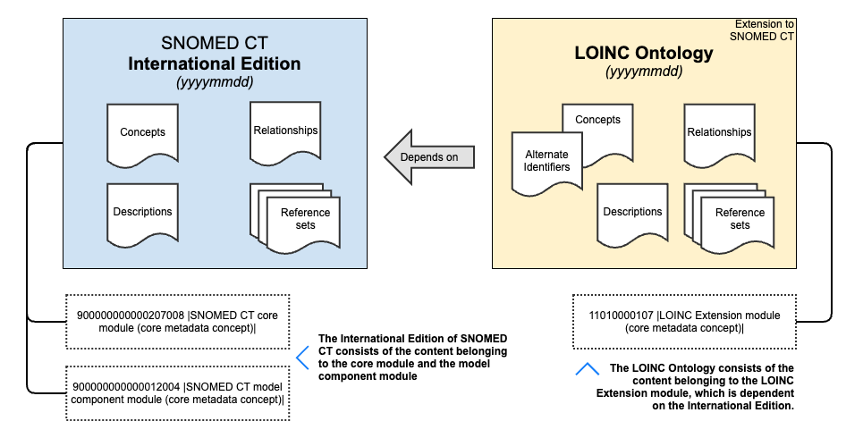

# 2.2 LOINC Extension to SNOMED CT

The LOINC Ontology is represented as an **Extension to SNOMED CT**, which provides a way to integrate LOINC (Logical Observation Identifiers Names and Codes) codes into SNOMED CT, enhancing interoperability between these two major terminologies in clinical and laboratory domains. The extension ensures that LOINC codes can be used as identifiers for relevant SNOMED CT concepts, allowing consistent and standardized data exchange across different healthcare systems

## Overview 

The diagram below how the **LOINC Ontology** extends the **SNOMED CT International Edition**, enabling the representation of LOINC-coded laboratory observations within SNOMED CT’s logical framework.

The **SNOMED CT International Edition** consists of core international components, structured under:

* `900000000000207008 | SNOMED CT core module (core metadata concept)|`
* `900000000000012004 | SNOMED CT model component module (core metadata concept)|`

The **LOINC Ontology** builds on SNOMED CT by incorporating **Alternate Identifiers**, aligning LOINC codes with SNOMED CT concepts. Its content resides within the 11010000107 | LOINC Extension module (core metadata concept) |.

Each version of the LOINC Ontology depends on a specific version of the SNOMED CT International Edition, and the LOINC Ontology cannot function independently. Any implementation of the LOINC Ontology requires the SNOMED CT International Edition for proper use.

<figure><figcaption></figcaption></figure>

## Key Features of the LOINC Extension 

1. **SNOMED CT Extension Format**:
   * The extension is published as a **standard SNOMED CT extension** and adheres to the format specifications outlined by SNOMED International (at [snomed.org/rfs](https://www.snomed.org/rfs) and [snomed.org/extpg](https://www.snomed.org/extpg)).
   * This ensures that the extension maintains consistency with the core SNOMED CT release format and other compatible extensions.
2. **LOINC Codes Modeled as SNOMED CT Concepts**
   * LOINC terms are integrated into the extension ensuring a precise **semantic alignment** between the two terminologies.
   * Each LOINC term included in the LOINC Ontology is represented as a **SNOMED CT concept**, with its properties explicitly defined according to SNOMED CT’s logical framework and concept model.
3. **Alternative Identifiers**:
   * The LOINC codes are assigned as **alternative identifiers** to the SNOMED CT concept representing the equivalent meaning as the LOINC code.
   * These alternative identifiers are maintained in the **Identifier File** of the extension in compliance with the [SNOMED CT Identifier File Specification](https://confluence.ihtsdotools.org/display/DOCRELFMT/4.2.4+Identifier+File+Specification?src=sidebar).
     * **Identifier File Structure**:
       * The Identifier File associates LOINC codes to semantic equivalent SNOMED CT concepts.
       * Each entry in the Identifier File specifies:
         * The SNOMED CT concept ID.
         * The corresponding LOINC code as the alternate identifier.
         * Metadata such as effective dates, active status, and module identifiers.
