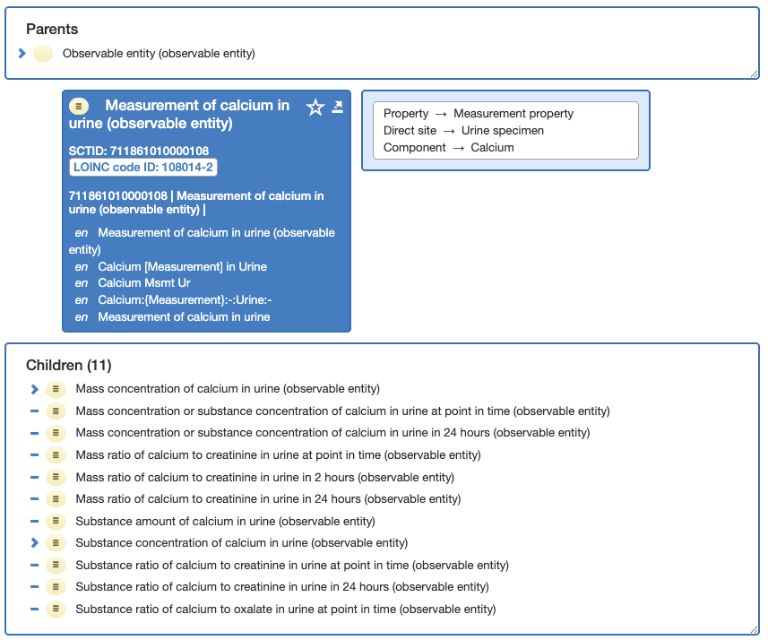

# LOINC Groupers

LOINC groupers are included in the LOINC Ontology to allow more general test ordering, and also to support navigation and querying by enabling identification of related tests that share the same property, system, and component.

Grouper concepts are modeled using a subset of defining attributes, typically Property, System, and Component. Attributes such as time and scale are intentionally not included. This approach ensures that more specific observables, which differ by time (for example, point in time or 24 hours) or scale (for example, quantitative or ordinal), are subsumed under a common parent concept.

### Example

The concept 711861010000108 | Measurement of calcium in urine (observable entity) |

is defined using the following three attribute-value pairs:

* 370130000 |Property (attribute)| = 685451010000100 |Measurement property (qualifier value)|
* 704327008 |Direct site (attribute)| = 122575003 |Urine specimen (specimen)|
* 246093002 |Component (attribute)| = 5540006 |Calcium (substance)|&#x20;

The concept does not contain the time or scale attribute. As a result, all observables representing measurements of calcium in urine are classified under this concept, regardless of differences in timing or scale.

As shown in the image above, this modeling allows all the specific tests of urine calcium levels to be subsumed by this concept.
