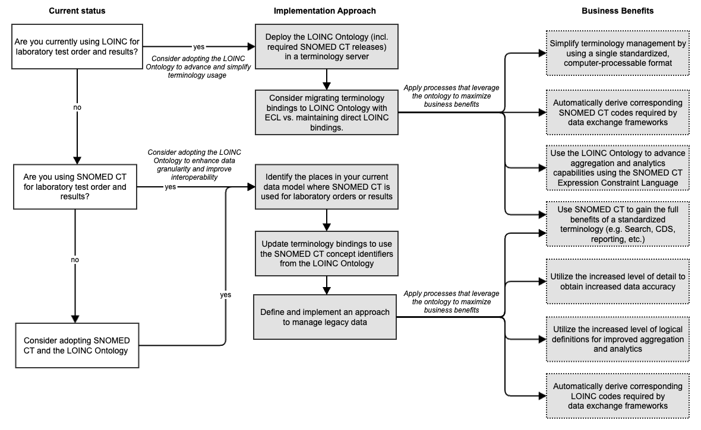

# 6.1. Implementation Approaches and Considerations

## Determine the Appropriate Approach 

The workflow below outlines key considerations for adopting the SNOMED CT Ontology for laboratory test orders and results. A thorough understanding of how lab tests are currently ordered and recorded, along with the specific benefits sought, is essential before making this decision.

The process begins by evaluating the organization’s use of LOINC or SNOMED CT and determining whether transitioning to the LOINC Ontology would improve standardization and interoperability. It then provides a structured implementation approach, including deploying terminology servers, updating terminology bindings, and managing legacy data.

By adopting the SNOMED CT Ontology, organizations can streamline terminology management, enhance data accuracy, improve analytics, and facilitate seamless data exchange. This structured approach supports informed decision-making and ensures alignment with organizational goals.

<figure><figcaption></figcaption></figure>

## Implementation Approaches 

### Deploy the LOINC Ontology (including required SNOMED CT releases) in a terminology server 

The first step in setting up the LOINC Ontology is to install it in a SNOMED CT-enabled terminology server. The deployment process includes loading the latest release of the LOINC Ontology including required versions of the international and/or national edition, as described in 6.3 Deploying the LOINC Ontology. Using standardized APIs like FHIR Terminology Services ensures smooth data exchange between different systems, making lab test orders and results more standardized and interoperable.

### Migrate terminology bindings to LOINC Ontology with ECL vs. maintaining direct LOINC bindings 

Most healthcare systems currently use direct LOINC codes for lab tests. However, moving to the LOINC Ontology with SNOMED CT improves flexibility and automation. The SNOMED CT Expression Constraint Language (ECL) allows dynamic queries to fetch relevant codes instead of manually mapping them one by one. To migrate, organizations should first identify where LOINC codes are used and create ECL rules that match appropriate SNOMED CT concepts included in the LOINC Ontology. This approach reduces manual work, improves consistency, and makes terminology updates easier to manage in the future. Chapter 5.2 Terminology Bindings suggests bindings that may be relevant for such migration.

### Analyze the current data model where laboratory orders or results are represented 

To ensure a smooth transition to the LOINC Ontology, it is crucial to first analyze how your system currently represents laboratory test orders and results. This involves identifying all locations in the data model where SNOMED CT, LOINC, or other code systems are applied and understanding how they interact with existing workflows and data exchange processes. By mapping out these connections, organizations can determine whether the current implementation is consistent, accurate, and aligned with best practices.

The goal of this analysis is to identify whether these codes should be updated to use concepts from the LOINC Ontology. This step helps optimize terminology bindings, improve interoperability, and ensure a more structured approach to laboratory data management. Using terminology auditing tools and automated reports can assist in detecting inconsistencies, redundant mappings, or areas where refinements are needed.

### Update terminology bindings to use the SNOMED CT concept identifiers from the LOINC Ontology 

Once the LOINC Ontology is deployed, the next step is to evaluate the benefits of replacing direct LOINC terminology bindings with updated LOINC Ontology / SNOMED CT bindings that can take advantage of techniques like ECL Expressions. This is an optional step that can facilitate the maintenance and precision of the bindings.

### Define and implement an approach to manage legacy data 

Older lab test records still contain historical LOINC codes or SNOMED CT identifiers, so ensuring they remain usable after the transition is important. This means mapping old codes to their closest equivalent in the LOINC Ontology while keeping track of changes for future reference. Automated conversion tools can help in bulk updating records while maintaining historical integrity. A phased approach, starting with testing in a controlled environment before full deployment, ensures a smooth transition while avoiding data loss or inconsistencies.
