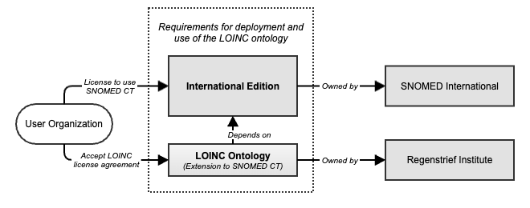

# Accessing the LOINC Ontology

The LOINC ontology is represented as a SNOMED CT extension and is distributed as an independent package.

Each version of a SNOMED CT extension depends on a specific version of the International Edition (refer to section [Module Dependencies](https://app.gitbook.com/s/3RKZIWpWFT0ocCgNT16E/4-logical-design/4.2-modules/4.2.2-module-dependencies) for more details). Therefore, deploying the LOINC ontology requires access to both the LOINC ontology release package and the corresponding International Edition release package, upon which the specific version of the LOINC ontology is dependent.

<figure><figcaption></figcaption></figure>

## License to Use SNOMED CT 

To access and use the LOINC ontology, users must have a valid Affiliate License for SNOMED CT. SNOMED CT is a globally recognized clinical terminology standard, and its usage is governed by strict licensing agreements to ensure compliance and proper utilization. Licensing ensures that users are authorized to access and implement SNOMED CT in their systems.

Individuals or organizations interested in using SNOMED CT must obtain an Affiliate License through their National Release Center (NRC) or SNOMED International.

More information can be found here: [https://www.snomed.org/get-snomed](https://www.snomed.org/get-snomed)

The following points outline the key aspects of member licensing:

* **Member Countries:** Member countries have a national licensing arrangement with SNOMED International. Healthcare professionals and organizations within these countries can usually access SNOMED CT through their NRC without additional licensing fees.
* **Access via NRCs:** National Release Centers are responsible for distributing SNOMED CT within their respective countries. They provide access, support, and updates to licensed users. Users should contact their NRC for specific details on how to access the LOINC Extension to SNOMED CT.
* **Non-Member Countries:** In countries that are not members of SNOMED International, individuals and organizations must directly approach SNOMED International to obtain the necessary licenses. This may involve additional costs and compliance with international licensing requirements.

## Accessing the LOINC Extension 

The LOINC Extension can be accessed via its main website hosted by Regenstrief:

[https://loincsnomed.org/downloads](https://loincsnomed.org/downloads)

<a href="https://docs.google.com/forms/d/e/1FAIpQLScTmbZIf0UEQwYDkY27EEWBkaiYkHSbR0_9DmFrMLXoQLyL7Q/viewform?usp=pp_url&entry.1767247133=LOINC+Implementation+Guide&entry.670899847=Accessing%20the%20LOINC%20Ontology" class="button primary">Provide Feedback</a>
