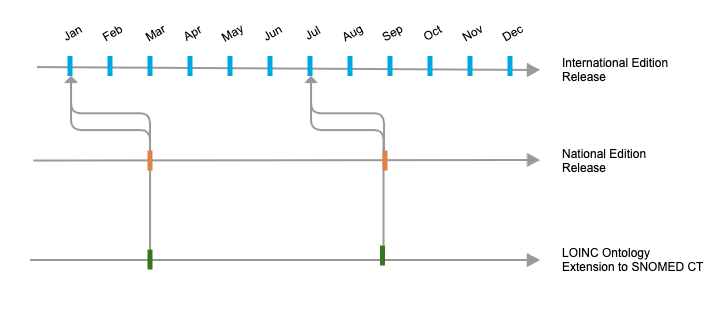
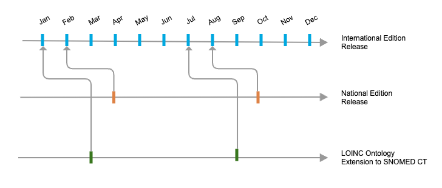
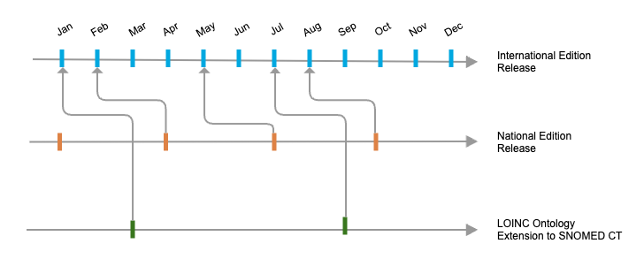

# 6.3 Deploying the LOINC Ontology

## Introduction <a href="#id-6.3deployingtheloincontology-introduction" id="id-6.3deployingtheloincontology-introduction"></a>

Effective deployment of the **LOINC Ontology** requires efficient access to the content in ways that take advantage of the features of both terminologies. A **terminology service** is a software function that interfaces with, and provides access to, one or more representations of a terminology, allowing for streamlined retrieval and management of terminology data.

Various technical options are available for implementing terminology services, including relational databases, graph databases, and predefined services accessible via APIs (e.g., **SNOMED International’s Snowstorm**). Selecting an appropriate approach for deploying the LOINC Extension depends on factors such as existing infrastructure, integration complexity, and the level of flexibility required. Whether using a local database or a cloud-based solution, the choice should ensure effective access, updating, and management of the terminology content.

Regardless of the platform chosen, the deployment of the LOINC Extension involves importing a SNOMED CT Edition and the LOINC Extension into the selected database or server.

## Required Release Packages <a href="#id-6.3deployingtheloincontology-requiredreleasepackages" id="id-6.3deployingtheloincontology-requiredreleasepackages"></a>

To deploy the LOINC Ontology, the following RF2 packages are necessary:

* The latest version of the national release available
* For national extension packages, the corresponding SNOMED CT International Edition (the version on which the national extension is dependent)
* The latest version of the LOINC Extension package, where the International Edition dependency aligns with the version being used

Release notes accompanying the LOINC Extension package detail the International Edition dependency, helping to ensure compatibility.

## Understanding Releases and Dependencies <a href="#id-6.3deployingtheloincontology-understandingreleasesanddependencies" id="id-6.3deployingtheloincontology-understandingreleasesanddependencies"></a>

The LOINC Ontology aligns with specific releases of the SNOMED CT International Edition. Each version of the LOINC Extension is updated in sync with the International Edition to ensure consistent compatibility.

**The LOINC Ontology is planned for biannual releases, occurring in March and September, following the LOINC release from the preceding month.**

National Editions follow independent release cycles, which vary by country or member organization, and may be released monthly, quarterly, or biannually. SNOMED CT is designed to handle these variations, using comprehensive history tracking to manage discrepancies that may arise from differing release cycles.

For example, if a National Edition is released in May based on the March International Edition, and the LOINC Extension is based on the February International Edition, there may be references to inactive concepts between releases. SNOMED CT enables easy identification and resolution of these references, maintaining the LOINC Extension’s consistency across different release schedules.

#### Scenario 1: The National Edition dependent on the same version of the International Edition than the LOINC Ontology <a href="#id-6.3deployingtheloincontology-scenario1-thenationaleditiondependentonthesameversionoftheinternatio" id="id-6.3deployingtheloincontology-scenario1-thenationaleditiondependentonthesameversionoftheinternatio"></a>

<figure><figcaption></figcaption></figure>

No potential implementation issues can be described for this scenario. In this case, the National Edition and the LOINC Ontology follow the same release cycle and depend on the same version of the International Edition. This alignment simplifies implementation by eliminating version discrepancies. Any changes made to the International Edition that impact both the LOINC Ontology and the National Edition will be managed by their respective owners.

#### Scenario 2a: The National Edition dependent on a different version of the International Edition than the LOINC Ontology <a href="#id-6.3deployingtheloincontology-scenario2a-thenationaleditiondependentonadifferentversionoftheintern" id="id-6.3deployingtheloincontology-scenario2a-thenationaleditiondependentonadifferentversionoftheintern"></a>

<figure><figcaption></figcaption></figure>

In this example, an implementer in November may select to use the October release of the National Edition with the latest LOINC Ontology release available, the September release.

The National Edition is the primary resource that determines the selection of dependency. As a derivative, the LOINC Ontology must align with the dependencies of the National Edition.

When deployed in an implementation terminology server, the configuration will be as follows:

* **International Edition (August release)** – The version on which the National Edition depends.
* **LOINC Ontology (September release)** – Originally dependent on the July version of the International Edition, which is no longer available.
* **National Edition (October release)** – The authoritative edition dictating dependencies.

In this setup, any changes made to the International Edition between July and August may impact the LOINC Ontology, as outlined below.

#### Scenario 2b: The National Edition doesn't follow the same release schedule as the LOINC Ontology <a href="#id-6.3deployingtheloincontology-scenario2b-thenationaleditiondoesntfollowthesamereleasescheduleasthe" id="id-6.3deployingtheloincontology-scenario2b-thenationaleditiondoesntfollowthesamereleasescheduleasthe"></a>

<figure><figcaption></figcaption></figure>

In this example, an implementer in September may select to use the July release of the National Edition with the latest LOINC Ontology release available, the September release.

When deployed in an implementation terminology server, the configuration will be as follows:

* **International Edition (May release)** – The version on which the National Edition depends.
* **LOINC Ontology (September release)** – Originally dependent on the July version of the International Edition, which is unavailable.
* **National Edition (July release)** – The authoritative edition dictating dependencies. The latest available National Release is in September.

Here, the LOINC Ontology may refer to an International Edition Concept created after the May release and, therefore, it would be unavailable in this environment.

### Potential Issues <a href="#id-6.3deployingtheloincontology-potentialissues" id="id-6.3deployingtheloincontology-potentialissues"></a>

Using a version of the LOINC Ontology that relies on a different version of the International Edition than the one used by the National Edition may lead to the following errors:

* **Inactive or Unknown Parent Concepts** – A LOINC Ontology concept may reference a parent that is no longer active or is unrecognized.
* **Inactive or Unknown Attribute Values** – International Edition concepts used as attribute values for LOINC Ontology concepts may be inactive or unknown.

These issues can arise in two ways:

* **Inactive Concepts** – If a concept has been inactivated in the International Edition after the release of the LOINC Ontology, but the National Edition is using a more recent version, the referenced concept may no longer be valid.
* **Unknown Concepts** – If the National Edition depends on an older version of the International Edition than the one used by the LOINC Ontology, some referenced concepts may be missing or unrecognized.

### Consequences <a href="#id-6.3deployingtheloincontology-consequences" id="id-6.3deployingtheloincontology-consequences"></a>

When discrepancies exist between the National Edition and the LOINC Ontology dependencies, several issues may arise:

* **ECL selections may fail for concepts with version errors**
  * For example, If a parent of a LOINC Ontology concept has been inactivated, then aggregations using the '<' operator (or other ECL hierarchy selections) will not include the child concept
  * ECL queries referencing inactive concepts directly are invalid
* **Data Inconsistencies**: If the National Edition and LOINC Ontology reference different versions of the International Edition, inconsistencies in data representation can occur, leading to errors in reporting and analytics.
* **Decision Support Errors**: Clinical decision support tools may provide incorrect or outdated recommendations if they refer to inactive or changed concepts.
* **Reporting errors**: missing the inclusion of concepts that do not match ECL selections

### Mitigation Strategies <a href="#id-6.3deployingtheloincontology-mitigationstrategies" id="id-6.3deployingtheloincontology-mitigationstrategies"></a>

To minimize disruption from dependency discrepancies, users can adopt several strategies:

* **Regular monitoring of concept status:** Use SNOMED CT tools to track inactive and replaced concepts.
* **Automated mapping and remediation:** Utilize historical associations and mapping tables to replace inactive concepts with suitable alternatives.
* **Pre-implementation impact assessment:** Before deploying the LOINC Ontology, run queries to identify any inactive concepts and resolve dependencies.
* **Interoperability testing:** Conduct validation tests between systems using different SNOMED CT versions to identify and address inconsistencies.
* **Stakeholder collaboration:** Work with national health agencies, SNOMED International, and terminology service providers to ensure smooth transitions and updates.

### Impact Assessment <a href="#id-6.3deployingtheloincontology-impactassessment" id="id-6.3deployingtheloincontology-impactassessment"></a>

Evaluating the impact of discrepancies between the dependency for the National Edition and the dependency for the LOINC Ontology is important for maintaining data consistency, usability, and interoperability. Users can assess the impact through several key factors:

1. **Concept availability and integrity**
   * If the National Edition is based on a different version of the SNOMED CT International Edition than the LOINC Ontology, there may be concepts referenced in the LOINC Extension that are inactive or unavailable in the National Edition.
   * Users should assess whether key concepts required for coding, reporting, and decision support are missing or have been replaced with new concepts.
2. **Reference set consistency**
   * National Extensions often include locally defined reference sets that may be linked to specific versions of the SNOMED CT International Edition.
   * If the LOINC Extension relies on an older or newer International Edition, these reference sets may contain outdated or inactive concepts, impacting decision support systems and automated processing.
3. **Historical tracking and concept mapping**
   * SNOMED CT provides robust historical tracking mechanisms, allowing users to identify inactive concepts and their replacements.
   * Using built-in SNOMED CT tooling, users can identify whether any inactive concepts within the LOINC Extension need to be mapped to newer active concepts in the National Edition.
4. **Data interoperability and exchange**
   * Differences in dependencies can affect interoperability between systems using different National Editions and LOINC Extensions.
   * Users should evaluate whether discrepancies lead to misinterpretation of coded data in electronic health records (EHRs), data analytics, or interoperability workflows.
5. **Impact on Clinical Decision Support (CDS)**
   * If SNOMED CT concepts referenced by the LOINC Ontology are inactive in the National Edition, decision support tools relying on those concepts may malfunction or provide inaccurate suggestions.
   * Organizations should review decision support rules that involve LOINC Ontology concepts and adjust them accordingly.
6. **Workflow and implementation strategies**
   * Organizations deploying the LOINC Ontology should determine whether discrepancies require immediate resolution or can be addressed through routine updates.
   * Depending on the workflow, a decision should be made whether to accept inactive concepts temporarily or proactively align the National Edition with the latest SNOMED CT International Edition.

#### Summary of Actions <a href="#id-6.3deployingtheloincontology-summaryofactions" id="id-6.3deployingtheloincontology-summaryofactions"></a>

| **Category**                                                          | **Action**                                                                                                                          | Query Example                                                                                                                    | **Description**                                                                                                                                                                                                                                                                                                                                                                                   |
| --------------------------------------------------------------------- | ----------------------------------------------------------------------------------------------------------------------------------- | -------------------------------------------------------------------------------------------------------------------------------- | ------------------------------------------------------------------------------------------------------------------------------------------------------------------------------------------------------------------------------------------------------------------------------------------------------------------------------------------------------------------------------------------------- |
| <ol><li><strong>Concept Availability and Integrity</strong></li></ol> | Identify concepts with inactive parents and check if replacements are available.                                                    | \<! ( \* \{{ C effectiveTime>=                                                                                                   | <p><strong>Identify concepts with inactive parents</strong></p><p>This query is satisfied by the direct parents (&#x3C;!) of any (*) concept in the substrate , where those concepts have an effectiveTime greater than or equal to the specified date, and an active value of false (i.e. only inactive concepts are returned)</p><p>Note that 20250101 is just provided here as an example.</p> |
| **2. Reference Set Consistency**                                      | Analyze reference sets to identify outdated or inactive concepts.                                                                   | ^ (< [446609009 \|Simple type reference set (foundation metadata concept)\|](http://snomed.info/id/446609009) )\{{ C active=0\}} | _Note that this ECL only retrieves the members of simple type reference sets. If other types are required, the concept id for those types can be applied._                                                                                                                                                                                                                                        |
| **3. Historical Tracking and Concept Mapping**                        | Identify inactive concept references in maps.                                                                                       | ^ (< [900000000000496009](http://snomed.info/id/900000000000496009)                                                              | Simple map from SNOMED CT type reference set (foundation metadata concept)                                                                                                                                                                                                                                                                                                                        |
| **4. Data Interoperability and Exchange**                             | Assess interoperability risks due to dependency mismatches.                                                                         | N/A                                                                                                                              | Based on historical interoperability data, it would be possible to verify the recorded frequency of use of the concepts with incorrect references. Finding that a very common concept has incorrect references with the new dependencies might lead to the need to take remedial actions in a new local release.                                                                                  |
| **5. Impact on Clinical Decision Support (CDS)**                      | Identify inactive or missing concepts in CDS rules.                                                                                 | N/A                                                                                                                              | Existing Clinical Decision Support rules should be analyzed to identify if they directly reference an inactive concept or a concept affected by references to inactive concepts.                                                                                                                                                                                                                  |
| **6. Workflow and Implementation Strategies**                         | Decide whether to temporarily accept inactive concepts or proactively align the National Edition with the latest SNOMED CT version. | N/A                                                                                                                              | <p>It is possible to include fixes in a new release of the national or local extension for mismatches between the LOINC Extension and the International Edition.</p><p>However, after careful evaluation of the existing mismatches, implementers can decide to go forward with a deployment of the terminology that includes a limited number of incorrect references.</p>                       |

#### Identifying References to Inactive Concepts <a href="#id-6.3deployingtheloincontology-identifyingreferencestoinactiveconcepts" id="id-6.3deployingtheloincontology-identifyingreferencestoinactiveconcepts"></a>

Inactive concepts within the LOINC Ontology can be managed effectively using the SNOMED CT Expression Constraint Language, which allows you to extract inactive components and reference set members.

_Retrieve inactive concepts from all SNOMED CT hierarchies belonging to the LOINC Ontology module:_

```
* {{ C moduleId = 11010000107 active=0}}
```

_Retrieve inactive concepts from the Observable entity hierarchy belonging to the LOINC Ontology module:_

```
< 363787002 |Observable entity (observable entity)| {{ C moduleId = 11010000107 active=0}}
```

This query identifies all concepts within the LOINC Extension that are currently inactive (active = false). It is useful for reviewing or managing outdated concepts.

#### Working with Active Components Only <a href="#id-6.3deployingtheloincontology-workingwithactivecomponentsonly" id="id-6.3deployingtheloincontology-workingwithactivecomponentsonly"></a>

If you prefer to work exclusively with active concepts, you can use the inverse ECL query.

_Retrieve active concepts from all SNOMED CT hierarchies belonging to the LOINC Ontology module:_

```
* {{ C moduleId = 11010000107 active=1}}
```

_Retrieve active concepts from the Observable entity hierarchy belonging to the LOINC Ontology module:_

```
< 363787002 |Observable entity (observable entity)| {{ C moduleId = 11010000107 active=1}}
```

This query returns only those concepts that are currently active, ensuring that you are working with up-to-date information. You can further refine this query by adding hierarchical filters, such as focusing on concepts within a particular clinical hierarchy.

## Implementation Considerations <a href="#id-6.3deployingtheloincontology-implementationconsiderations" id="id-6.3deployingtheloincontology-implementationconsiderations"></a>

Despite these potential issues, the actual risk of problems is considered low due to the design of the LOINC Ontology. The LOINC Ontology has a flat hierarchical structure, therefore the number of International Edition parents is very low. These parent concepts are stable groupers in the International Edition, minimizing the risk of inactivation. The concepts used as attribute values come from a recent mapping effort between LOINC parts and SNOMED CT concepts, meaning most have been reviewed recently. As a result, a degree of stability is also expected for the attribute values. Using a newer version of the International Edition with the LOINC Ontology has a lower risk of inconsistencies than using an older version of the International Edition. This due to the fact that attribute concepts could be created during the process of updating the LOINC Ontology to a new version.

When deploying the LOINC Extension to SNOMED CT, you have two main options:

1. **Use the Extension as-is, accepting that some components may reference inactive concepts**
   * **Benefit**: Minimal setup time and resource use.
   * **Challenge**: Potential use of inactive concepts, which may affect coding accuracy.
   * This approach is commonly used because it offers quick deployment, and SNOMED CT provides methods for managing inactive content, such as historical associations. The best practice is to use the latest version of the published LOINC Extension, ensuring alignment with a current SNOMED CT International Edition.
2. **Conduct pre-implementation processing to resolve references to inactive concepts**
   * **Benefit**: The LOINC Extension will fully align with the current SNOMED CT version.
   * **Challenge**: Requires SNOMED CT expertise, services for identifying replacements, and services for publishing the updated extension.
